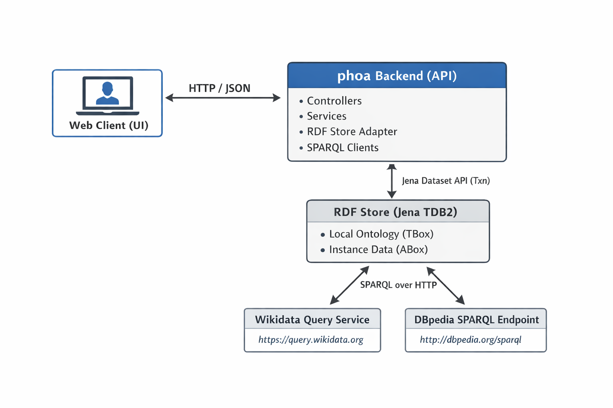

# PhoA — Phobia-related Web Assistant (Semantic Web + Context-Aware Alerts)

PhoA is a Semantic Web–driven application for managing and monitoring phobias using an RDF knowledge base.  
The backend stores all application state as RDF (Apache Jena + TDB2), exposes REST APIs for ingestion/querying, and enriches
local concepts using Linked Open Data (Wikidata + DBpedia). The frontend is a React + TypeScript SPA that consumes these APIs
and surfaces RDF identifiers (IRIs) and external links as first-class UI elements.

---
[](https://www.youtube.com/watch?v=koNwUeG-iKE&t=2s)


## Demo video
[Watch the demo](Scholarly/DemoPhoa720.mp4)


## Key Features

- **RDF-first persistence**: all internal state stored as RDF triples in **Jena TDB2** (TBox + ABox).
- **Context & observation ingestion**: create semantic contexts and SOSA observations via REST.
- **Context-aware alerts**: evaluate context/observations and generate notifications.
- **Interventions library**: interventions/resources returned from RDF store and rendered in UI (with IRIs).
- **Entourage / Trust Circle (FOAF)**: CRUD contacts modeled as `foaf:Person` with panic-alert enablement.
- **External enrichment**: Wikidata/DBpedia SPARQL queries to suggest/enrich phobia concepts.
- **SHACL validation**: ingestion can be validated and errors returned as a SHACL report (Turtle/JSON).

---

## Architecture



- **Backend**: Controllers → Services → RDF Store adapter (Jena Dataset/TDB2)  
- **External KBs**: SPARQL over HTTP to Wikidata Query Service and DBpedia endpoint

---

## Tech Stack

### Backend
- Java + Spring Boot
- Apache Jena (Dataset, SPARQL, TDB2)
- RDF/OWL/RDFS + vocabulary reuse (Schema.org, SOSA, FOAF, W3C Time)
- SHACL validation + debug report endpoints

### Frontend
- React (SPA) + TypeScript
- CSS Modules
- Fetch API service layer
- UI modules: Home, Dashboard, Ingest, Resources, Entourage

---

## Data Model (high level)

- **Users**: `phoa:User`
- **Phobias**: `phoa:Phobia` aligned to Wikidata/DBpedia via `skos:exactMatch` / `owl:sameAs`
- **Per-user phobia state (reified association)**: `phoa:PhobiaAffliction`
  - allows attaching `phoa:severity`, `phoa:afflictionStart`, etc.
- **Contexts**: `phoa:Context` with optional time/event/place/season/source nodes
- **Observations (SOSA)**: `sosa:Observation` with `sosa:observedProperty`, simple result, result time, optional sensor/unit
- **Notifications**: `phoa:Notification` linked to detected phobia/context and delivered interventions
- **Entourage contacts (FOAF)**: `foaf:Person` + relationship + alertsEnabled

The ontology seed is stored in `phobia_model.ttl`.

---

## REST API — Endpoints (full list)

Base URL (local): `http://localhost:8080`

### Ingestion (manual semantic data injection)
- **POST** `/api/context`  
  Ingest a semantic **Context** (event/place/time/season/source) for a user.
- **POST** `/api/observations`  
  Ingest a **SOSA Observation** (sensor, observedProperty, value, unit, time, source) for a user.

### Users (profiles, phobias, context/observations, evaluation)
- **GET** `/api/users/{userLocalName}/phobias`  
  List the user’s phobias (RDF-backed).
- **POST** `/api/users/{userLocalName}/phobias`  
  Add a phobia to the user (creates/links local phobia + external Wikidata alignment).

- **GET** `/api/users/{userLocalName}/context/latest`  
  Get the **latest context** for a user (404 if none).
- **GET** `/api/users/{userLocalName}/observations/latest?property={observedPropertyUri}`  
  Get the **latest observation** for a given observed property (404 if none).

- **POST** `/api/users/{userLocalName}/evaluate`  
  Trigger rule/logic evaluation (may generate notifications; can return 204 when none are produced).

### Notifications
- **GET** `/api/users/{userLocalName}/notifications?limit=200`  
  List notification summaries for a user (filters out `read` in query logic; default limit 200).
- **POST** `/api/notifications/{id}/ack`  
  Acknowledge/mark a notification as read (defaults to `"read"` if omitted; 404 if not found).

### Entourage (FOAF-modeled trust circle)
- **GET** `/api/users/{userId}/entourage`  
  List entourage contacts for a user.
- **POST** `/api/users/{userId}/entourage`  
  Create an entourage contact (FOAF person + relationship + alertsEnabled).
- **PATCH** `/api/users/{userId}/entourage/{contactId}`  
  Partial update of an entourage contact (404 if not found).
- **DELETE** `/api/users/{userId}/entourage/{contactId}`  
  Delete an entourage contact (404 if not found).

### Interventions / Resources
- **GET** `/api/interventions`  
  List interventions/resources from the RDF model (hierarchy under `phoa:Intervention`).
- **GET** `/api/phobias/random?limit=5`  
  Random phobia suggestions (Wikidata-backed discovery; default limit 5).
- **GET** `/api/phobias/{phobiaId}/enrich`  
  Enrich a local phobia using external KBs (Wikidata/DBpedia) via stored alignment links.

### Admin
- **POST** `/api/admin/reset`  
  Reset RDF dataset to the initial ontology model.  
  Requires header: `X-Admin-Token: <token>` (403 if invalid).

### Debug / Semantic inspection
- **GET** `/debug/rdf`  
  Dump the RDF dataset as Turtle (`text/turtle`).

### SHACL debug (validation reports)
- **GET** `/debug/shacl`  
  SHACL report as plain text (`text/plain`).
- **GET** `/debug/shacl.ttl`  
  SHACL report as Turtle (`text/turtle`).
- **GET** `/debug/shacl.json`  
  SHACL report as JSON (`application/json`).
- **GET** `/debug/shacl/summary`  
  Compact SHACL conformance summary (`application/json`).


## Running the Backend

### Prerequisites
- Java (compatible with your Spring Boot version)
- Maven (or use `mvnw`)

### Start
.\mvnw.cmd spring-boot:run

## Running the Frontend

### Prerequisites
- Node.js (LTS recommended)
- npm (comes with Node)

### Start
```powershell
cd WebFrontend\DaVi---Web\Frontend\phoa-web
npm install
npm run dev